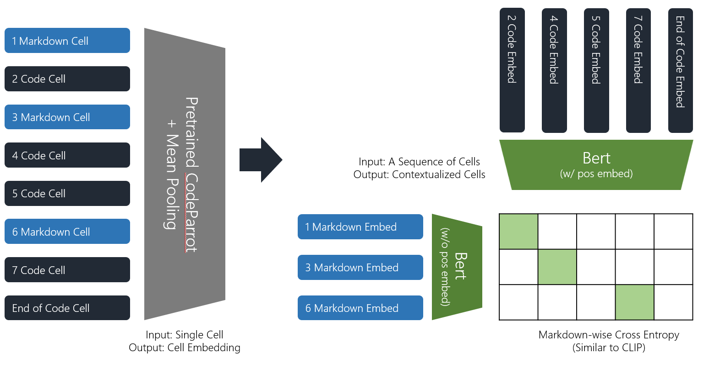

## [Google AI4Code Competition](https://www.kaggle.com/competitions/AI4Code)
The goal of this competition is to understand the relationship between code and comments in Python notebooks. You are challenged to reconstruct the order of markdown cells in a given notebook based on the order of the code cells, demonstrating comprehension of which natural language references which code.

## Overview of My Solution (Silver Medal, Top 2.6%)

1. 파이썬 노트북은 마크다운 셀과 코드 셀로 구성되어 있다. 각 셀을 Pretrained Transformer (CodeParrot)에 넣은 후 Mean Pooling을 하여 해당 셀에 대한 Embedding을 얻는다.
2. 마크다운 임베딩들을 Bert 모델에 넣어 해당 임베딩들이 맥락 정보를 담을 수 있도록 한다. 마찬가지로, 코드 임베딩들도 Bert 모델에 넣는다. 이때 코드 셀과 달리 마크다운 셀의 순서 정보는 모르므로 마크다운 임베딩을 위한 Bert의 Positional Embedding을 제거한다.
3. 맥락 정보가 담긴 마크다운 임베딩과 코드 임베딩을 [CLIP](https://arxiv.org/abs/2103.00020) 방법과 유사하게 학습시킨다. 특정 마크다운 셀을 기준으로 직후에 존재하는 코드 셀을 Positive, 나머지 코드 셀을 Negative로 취급하여 학습한다.
4. Bert 대신 T5 Encoder를 이용하여 학습한 후, 두 모델의 예측을 Ensemble 한다. (Not Uploaded)

## Possible Improvements
1. 데이터셋에 영어가 아닌 언어가 다수 섞여있는데 이를 전혀 고려하지 않았다. 영어가 아닌 셀을 번역하거나 사전 학습된 Multilingual 모델을 사용해야 했다.
2. 사전 학습된 모델로 코드 생성 모델인 CodeParrot이 아닌 코드 임베딩 모델인 CodeBert를 사용했으면 더 좋았을 것 같다. 컴퓨팅 자원의 한계로 CodeParrot의 파라미터를 고정시킨 채로 진행하였는데, 목표 태스크에 맞게 Finetuning 했으면 더 좋았을 것이다.
3. 지금은 Pair-wise Loss만 사용했는데, Point-wise Loss를 추가적인 학습 시그널로 사용할 수 있을 것 같고, 조금 더 다양한 Ensemble을 시도할 수 있을 것 같다.
